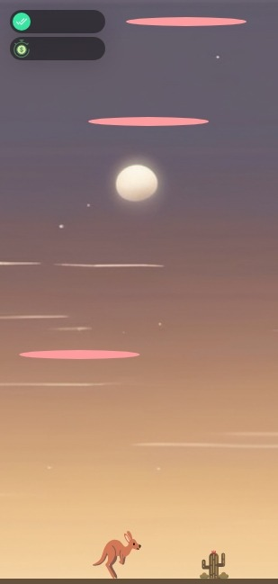

# Game-Hub

Welcome to Game-Hub! This repository is a collection of interactive games developed using HTML, CSS, and JavaScript.

## About

Game-Hub is a project aimed at creating entertaining and engaging web games. From classic favorites to innovative new concepts, we strive to provide enjoyable experiences for players of all ages.

## Technologies Used

- HTML5: Used for structuring the games and creating interactive elements.
- CSS3: Used for styling the games and making them visually appealing.
- JavaScript: Used for game logic, user interactions, and dynamic content.

## Games

### Rock Paper Scissors

Play the game [here](https://iamupo.github.io/FrontendMentor-Solutions/Rock-Paper-Scissors) View Code [here](https://github.com/iamupo/Game-Hub/tree/main/Rock-Paper-Scissors)

---

### KangaHops

Play the game [here](https://iamupo.github.io/Game-Hub/KangaHops/) View Code [here](https://github.com/iamupo/Game-Hub/tree/main/KangaHops)

---

## Development

The games in Game-Hub are developed using modern web technologies to ensure smooth gameplay and an enjoyable user experience. We focus on responsive design, dynamic animations, and intuitive interfaces to make our games accessible to everyone.

## Contribution

We welcome contributions from the community! If you have ideas for new games or improvements to existing ones, feel free to fork this repository, make your changes, and submit a pull request.

## Connect with Us

- LinkedIn: [Your LinkedIn Profile](https://www.linkedin.com/in/iamupo/)

Join us at Game-Hub and let's play together!

